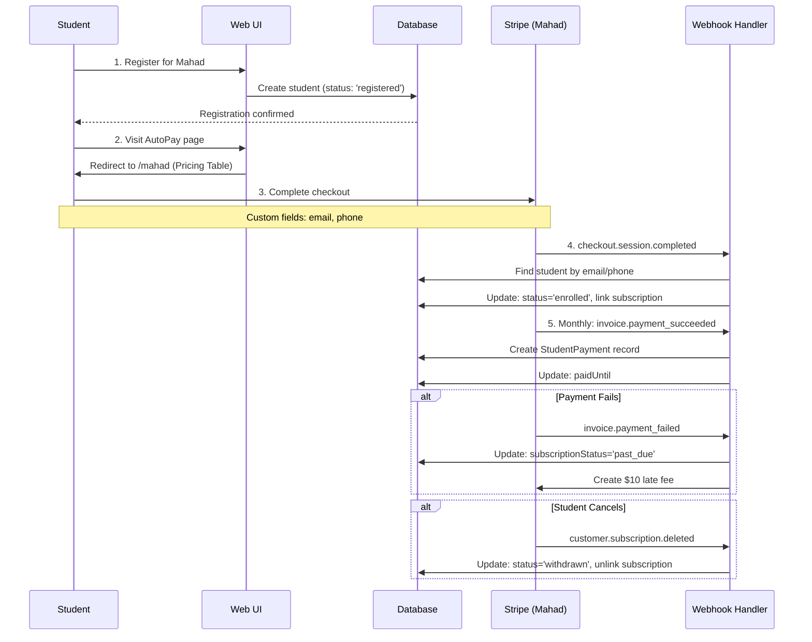
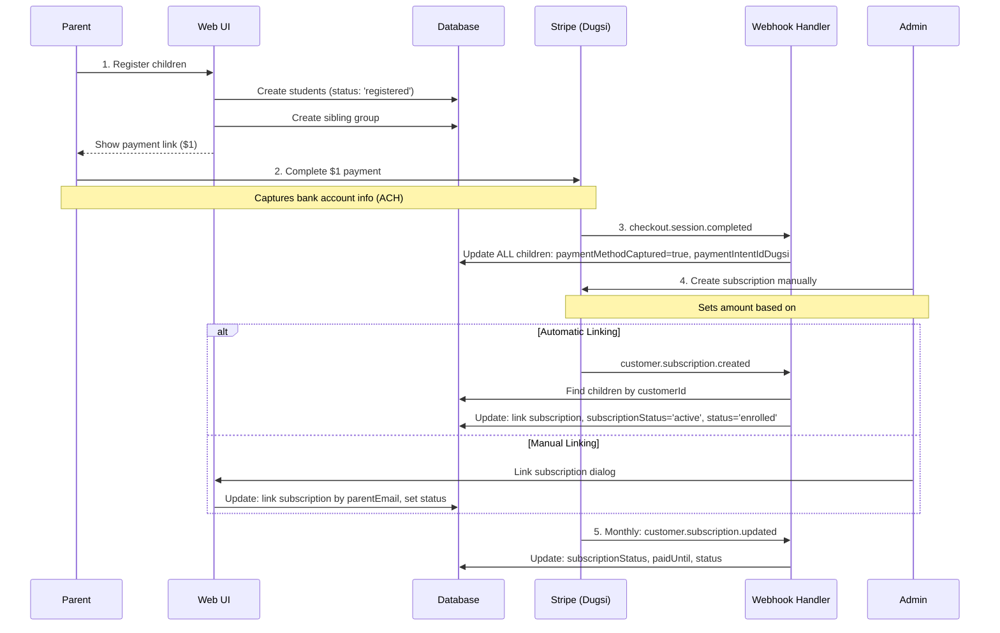

# Student-Subscription Correlation Architecture

Comprehensive documentation of the student-subscription management system for Irshad Center's dual educational programs (Mahad and Dugsi).

---

## Table of Contents

1. [Overview](#overview)
2. [Architecture](#architecture)
3. [Data Model](#data-model)
4. [Workflows](#workflows)
5. [Edge Cases](#edge-cases)
6. [Status Mapping](#status-mapping)
7. [Reference](#reference)

---

## Overview

### System Summary

The Irshad Center manages two educational programs with separate Stripe accounts and different enrollment workflows:

- **Mahad** (College students): Individual subscriptions, automated enrollment
- **Dugsi** (K-12 children): Family-based subscriptions, manual enrollment

The system tracks both **student status** (registered, enrolled, withdrawn, on_leave) and **subscription status** (active, canceled, past_due, etc.), synchronized via webhooks.

### Business Context

**Mahad Program**:

- Students typically pay for themselves (1:1 relationship)
- Occasionally one student pays for a sibling (creates orphaned subscription scenario)
- College students may have payment issues (overdraft, account changes)
- Cancelled subscriptions require re-enrollment with new subscription ID

**Dugsi Program**:

- Parents pay for multiple children (1:many relationship)
- Single subscription with variable amount based on number of children
- Payment method captured first ($1), then subscription created by admin
- New children added by updating existing subscription amount

---

## Architecture

### Tech Stack

- **Framework**: Next.js 15 (App Router)
- **Language**: TypeScript 5.3.3
- **Database**: PostgreSQL via Supabase
- **ORM**: Prisma 6.16.2
- **Payment**: Stripe 18.0.0 (dual accounts)
- **UI**: React 18, Radix UI, Tailwind CSS

### System Diagram

```
┌─────────────────────────────────────────────────────────────┐
│                     Irshad Center System                     │
├─────────────────────────────────────────────────────────────┤
│                                                               │
│  ┌──────────────┐         ┌──────────────┐                  │
│  │   Mahad      │         │    Dugsi     │                  │
│  │  (College)   │         │    (K-12)    │                  │
│  └──────┬───────┘         └──────┬───────┘                  │
│         │                        │                           │
│         ▼                        ▼                           │
│  ┌──────────────┐         ┌──────────────┐                  │
│  │   Stripe     │         │   Stripe     │                  │
│  │  Account 1   │         │  Account 2   │                  │
│  └──────┬───────┘         └──────┬───────┘                  │
│         │                        │                           │
│         └────────┬───────────────┘                           │
│                  ▼                                           │
│         ┌─────────────────┐                                  │
│         │    Webhooks     │                                  │
│         │   /api/webhook  │                                  │
│         └────────┬────────┘                                  │
│                  ▼                                           │
│         ┌─────────────────┐                                  │
│         │    Database     │                                  │
│         │   (PostgreSQL)  │                                  │
│         └─────────────────┘                                  │
│                                                               │
└─────────────────────────────────────────────────────────────┘
```

### Key Directories

```
/Users/mustafamuse/Desktop/irshad-center/
├── app/
│   ├── api/
│   │   └── webhook/
│   │       ├── route.ts                     # Mahad webhook handler
│   │       ├── dugsi/route.ts              # Dugsi webhook handler
│   │       └── student-event-handlers.ts   # Event processing
│   ├── mahad/
│   │   └── register/actions.ts             # Mahad registration
│   ├── dugsi/
│   │   └── register/actions.ts             # Dugsi registration
│   └── admin/
│       ├── dugsi/actions.ts                # Dugsi admin tools
│       ├── link-subscriptions/             # Orphan recovery tool
│       └── payments/actions.ts             # Payment management
├── lib/
│   ├── stripe.ts                           # Mahad Stripe client
│   ├── stripe-dugsi.ts                     # Dugsi Stripe client
│   ├── services/student-matcher.ts         # Student matching logic
│   └── queries/subscriptions.ts            # Subscription queries
└── prisma/
    └── schema.prisma                       # Database schema
```

---

## Data Model

### Student Table Schema

**File**: `/prisma/schema.prisma` (Lines 196-262)

```prisma
model Student {
  id: String @id @default(uuid())
  name: String
  email: String? @unique
  phone: String?

  // Status fields
  status: String @default("registered")
  subscriptionStatus: SubscriptionStatus?

  // Mahad Stripe fields
  stripeCustomerId: String? @unique
  stripeSubscriptionId: String?

  // Dugsi Stripe fields
  stripeCustomerIdDugsi: String?
  stripeSubscriptionIdDugsi: String?
  paymentIntentIdDugsi: String?  // For ACH bank verification via microdeposits
  paymentMethodCaptured: Boolean @default(false)
  paymentMethodCapturedAt: DateTime?
  familyReferenceId: String?

  // Program differentiation
  program: Program @default(MAHAD_PROGRAM)
  stripeAccountType: StripeAccountType?

  // Payment tracking
  paidUntil: DateTime?
  monthlyRate: Int @default(150)

  // Subscription history
  previousSubscriptionIds: String[] @default([])
  previousSubscriptionIdsDugsi: String[] @default([])

  // Relationships
  payments: StudentPayment[]
  batch: Batch? @relation(fields: [batchId], references: [id])
  siblingGroup: SiblingGroup? @relation(fields: [siblingGroupId], references: [id])
}
```

### Status Enums

**Student Status** (`/lib/types/student.ts:1-6`):

```typescript
export enum StudentStatus {
  REGISTERED = 'registered', // Initial state, not yet in classes
  ENROLLED = 'enrolled', // Actively attending classes
  ON_LEAVE = 'on_leave', // Temporary approved break
  WITHDRAWN = 'withdrawn', // No longer attending
}
```

**Subscription Status** (`/prisma/schema.prisma:349-358`):

```prisma
enum SubscriptionStatus {
  incomplete          // Initial payment pending
  incomplete_expired  // Payment never completed
  trialing           // In trial period
  active             // Subscription is active and paid
  past_due           // Payment failed, in grace period
  canceled           // Subscription has been canceled
  unpaid             // Subscription created but never paid
  paused             // Subscription paused
}
```

### Payment Audit Trail

```prisma
model StudentPayment {
  id: String @id @default(dbgenerated("gen_random_uuid()"))
  studentId: String
  year: Int
  month: Int
  amountPaid: Int
  paidAt: DateTime
  stripeInvoiceId: String?

  student: Student @relation(fields: [studentId], references: [id])

  @@unique([studentId, stripeInvoiceId])
  @@index([studentId, year, month])
}
```

**Note**: Payment history is preserved across subscription changes because `StudentPayment` is linked to `studentId`, not `subscriptionId`.

---

## Workflows

### Mahad Program Flow



**Key Features**:

- Automatic enrollment on successful checkout
- Student matching via email/phone custom fields
- Payment tracking via StudentPayment records
- 7-day grace period for failed payments (status remains 'enrolled')
- Automatic withdrawal on cancellation

### Dugsi Program Flow



**Key Features**:

- Family-based subscription management
- Two-step process: $1 payment capture, then admin creates subscription
- ACH bank account verification via microdeposits (PaymentIntent stored for verification)
- Automatic or manual subscription linking
- All siblings linked to same subscription
- Parent can add/remove children by updating subscription amount

### Student Matching Logic

**File**: `/lib/services/student-matcher.ts`

**Three Strategies** (in priority order):

```typescript
// Strategy 1: Custom field email (most reliable)
const customEmail = session.custom_fields?.find(
  (f) => f.key === 'studentsemailonethatyouusedtoregister'
)?.text?.value

// Strategy 2: Custom field phone
const customPhone = session.custom_fields?.find(
  (f) => f.key === 'studentswhatsappthatyouuseforourgroup'
)?.text?.value

// Strategy 3: Payer email (fallback)
const payerEmail = session.customer_details?.email
```

**Matching Constraints**:

- Only matches students with `stripeSubscriptionId: null`
- Prevents double-linking
- Uses regex for phone normalization

---

## Edge Cases

### Edge Case #1: Mahad Sibling Payments

**Scenario**:

1. Student A registers and enrolls
2. Student A's parent pays for BOTH Student A and sibling Student B
3. Parent completes checkout twice using Student A's email
4. Webhook receives two `checkout.session.completed` events

**Result**:

- First subscription links to Student A
- Second subscription has NO way to identify Student B
- Second subscription becomes orphaned

**Solution**:
Admin uses `/admin/link-subscriptions` to manually link second subscription to Student B.

**Future Enhancement**:

- Add "Paying for someone else?" flow with sibling selector during checkout
- Smart matching algorithm (same last name, same batch)

### Edge Case #2: Mahad Re-enrollment

**Scenario**:

1. Student enrolled with active subscription
2. Student's bank account has issues (overdraft/closed)
3. Stripe subscription fails and gets cancelled
4. Student needs to re-enroll with NEW subscription

**Current Behavior**:

- Webhook receives `customer.subscription.deleted`
- Student status → "withdrawn"
- Subscription unlinked
- Student data preserved
- Payment history preserved (linked to `studentId`, not subscription)

**Re-enrollment Process**:

- Student goes through pricing table again
- Creates NEW subscription with NEW ID
- Webhook links new subscription
- Old subscription ID moved to `previousSubscriptionIds` array

### Edge Case #3: Dugsi Adding/Removing Children

**Adding a Child**:

1. Parent registers new child through UI → status: "registered"
2. Admin updates subscription amount in Stripe manually
3. Subscription keeps same ID
4. Webhook `customer.subscription.updated` fires
5. System finds ALL children with same `stripeCustomerIdDugsi`
6. Updates all with new `paidUntil`

**Removing a Child**:

1. Admin marks child as "withdrawn"
2. System suggests reducing subscription amount
3. Admin confirms and updates in Stripe
4. Subscription amount reduced but keeps same ID

### Edge Case #4: Payment Method Updates

**Current Process**:

- Done in Stripe dashboard by admin
- No system changes needed

**Potential Improvement**:

- Self-service portal for students/parents
- Link from student dashboard → Stripe Customer Portal
- Auto-generated with `stripe.billingPortal.sessions.create()`

---

## Status Mapping

### Status Synchronization Function

**File**: `/lib/queries/subscriptions.ts:116-131`

Both Mahad and Dugsi webhooks use this function to maintain consistent status mapping:

```typescript
function getNewStudentStatus(
  subscriptionStatus: SubscriptionStatus
): StudentStatus {
  switch (subscriptionStatus) {
    case SubscriptionStatus.active:
      return StudentStatus.ENROLLED
    case SubscriptionStatus.canceled:
    case SubscriptionStatus.unpaid:
      return StudentStatus.WITHDRAWN
    case SubscriptionStatus.past_due:
      return StudentStatus.ENROLLED // Keep enrolled during grace period
    default:
      return StudentStatus.REGISTERED
  }
}
```

### Status Mapping Table

| Stripe subscriptionStatus      | Student status | Meaning                               |
| ------------------------------ | -------------- | ------------------------------------- |
| `active`                       | `enrolled`     | Actively attending, payments current  |
| `canceled`                     | `withdrawn`    | No longer attending                   |
| `unpaid`                       | `withdrawn`    | Payment failed beyond grace period    |
| `past_due`                     | `enrolled`     | Payment failed, in 7-day grace period |
| `trialing`, `incomplete`, etc. | `registered`   | Registered but not yet enrolled       |

### Webhook Implementation

**Mahad** (`/app/api/webhook/student-event-handlers.ts`):

```typescript
await prisma.student.updateMany({
  where: {
    stripeSubscriptionId: subscription.id,
    program: 'MAHAD_PROGRAM', // Program isolation
  },
  data: {
    subscriptionStatus: subscription.status,
    status: getNewStudentStatus(subscription.status),
    paidUntil: extractPeriodEnd(subscription),
  },
})
```

**Dugsi** (`/app/api/webhook/dugsi/route.ts`):

```typescript
await prisma.student.updateMany({
  where: {
    stripeCustomerIdDugsi: subscription.customer,
    program: 'DUGSI_PROGRAM',
  },
  data: {
    subscriptionStatus: subscription.status,
    status: getNewStudentStatus(subscription.status),
    paidUntil: extractPeriodEnd(subscription),
  },
})
```

---

## Reference

### Key Files

| File                                         | Purpose                               |
| -------------------------------------------- | ------------------------------------- |
| `/prisma/schema.prisma`                      | Database schema (Student model)       |
| `/app/api/webhook/route.ts`                  | Mahad webhook entry point             |
| `/app/api/webhook/dugsi/route.ts`            | Dugsi webhook entry point             |
| `/app/api/webhook/student-event-handlers.ts` | Mahad event processing                |
| `/lib/services/student-matcher.ts`           | Student matching logic                |
| `/lib/queries/subscriptions.ts`              | Subscription queries & status mapping |
| `/app/admin/dugsi/actions.ts`                | Dugsi admin operations                |
| `/app/admin/link-subscriptions/`             | Orphaned subscription recovery tool   |
| `/lib/stripe.ts`                             | Mahad Stripe client                   |
| `/lib/stripe-dugsi.ts`                       | Dugsi Stripe client                   |

### Stripe Webhook Events

**Mahad** (`/api/webhook`):

- `checkout.session.completed` → Link subscription, set status='enrolled'
- `invoice.payment_succeeded` → Create payment record
- `invoice.payment_failed` → Add late fee, set status='past_due'
- `customer.subscription.updated` → Sync status
- `customer.subscription.deleted` → Set status='withdrawn', unlink

**Dugsi** (`/api/webhook/dugsi`):

- `checkout.session.completed` → Capture payment method
- `customer.subscription.created` → Link subscription, update status
- `customer.subscription.updated` → Sync status
- `customer.subscription.deleted` → Cancel, set status to 'withdrawn'

### Environment Variables

```bash
# Mahad Stripe
STRIPE_SECRET_KEY_PROD=sk_live_xxx
STRIPE_WEBHOOK_SECRET_PROD=whsec_xxx
NEXT_PUBLIC_STRIPE_PUBLISHABLE_KEY_PROD=pk_live_xxx
NEXT_PUBLIC_STRIPE_PRICING_TABLE_ID=prctbl_xxx

# Dugsi Stripe
STRIPE_SECRET_KEY_DUGSI=sk_live_xxx
STRIPE_WEBHOOK_SECRET_DUGSI=whsec_xxx
NEXT_PUBLIC_STRIPE_PAYMENT_LINK_DUGSI=https://buy.stripe.com/xxx
```

### Useful Queries

**Find mismatched states**:

```sql
SELECT
  id, name, status, subscriptionStatus, program
FROM "Student"
WHERE
  (status = 'enrolled' AND subscriptionStatus NOT IN ('active', 'trialing', 'past_due'))
  OR (status = 'withdrawn' AND subscriptionStatus = 'active')
  OR (subscriptionStatus IN ('active', 'trialing') AND status != 'enrolled');
```

**Find students needing follow-up (Mahad)**:

```sql
SELECT id, name, email, createdAt
FROM "Student"
WHERE status = 'registered'
  AND stripeSubscriptionId IS NULL
  AND program = 'MAHAD_PROGRAM'
  AND createdAt < NOW() - INTERVAL '7 days';
```

**Find students needing follow-up (Dugsi)**:

```sql
SELECT id, name, parentEmail, createdAt
FROM "Student"
WHERE paymentMethodCaptured = true
  AND stripeSubscriptionIdDugsi IS NULL
  AND program = 'DUGSI_PROGRAM';
```

**Find orphaned subscriptions**:

```sql
-- Students with subscription status but no subscription ID
SELECT id, name, subscriptionStatus, program
FROM "Student"
WHERE subscriptionStatus IS NOT NULL
  AND stripeSubscriptionId IS NULL
  AND stripeSubscriptionIdDugsi IS NULL;
```

### Admin Tools

**Orphaned Subscription Recovery**: `/admin/link-subscriptions`

- Lists all orphaned subscriptions from both Stripe accounts
- Shows customer email, name, subscription status, and amount
- Searches for potential student matches
- Manual linking interface
- Supports both Mahad (1:1) and Dugsi (1:many family) linking

**State Validation Script**: `scripts/fix-status-mismatches.ts`

```bash
# Audit mode (read-only)
npx tsx scripts/fix-status-mismatches.ts

# Apply fixes
npx tsx scripts/fix-status-mismatches.ts --fix
```

---

**Maintainer Notes**:

- This document focuses on architecture and living system behavior
- Avoid adding point-in-time status updates (use git history for that)
- Update workflows/edge cases as business requirements change
- Keep reference queries up-to-date with schema changes
