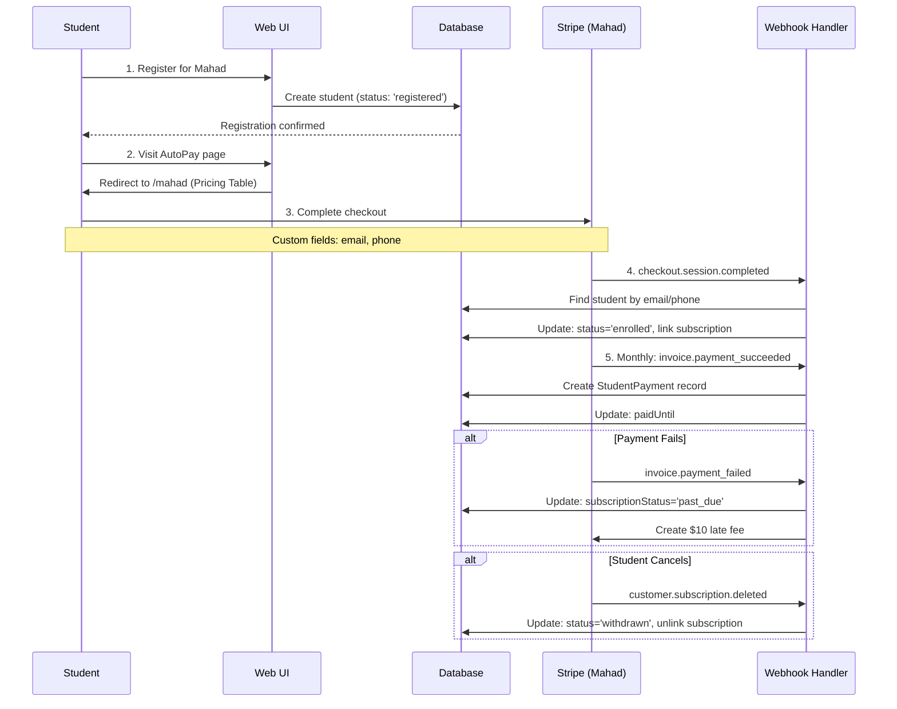
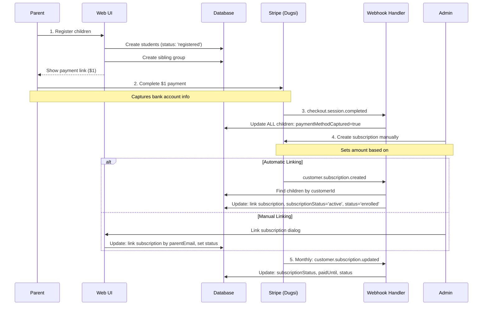

# Student-Subscription Correlation Analysis & Solutions

**Last Updated**: February 2025
**Status**: ✅ Status Field Fix Completed (See Implementation Status below)
**Owner**: Development Team

---

## Table of Contents

1. [Executive Summary](#executive-summary)
2. [Current Architecture](#current-architecture)
3. [Data Model](#data-model)
4. [Workflows](#workflows)
5. [Critical Issues](#critical-issues)
6. [Edge Cases](#edge-cases)
7. [Proposed Solutions](#proposed-solutions)
8. [Implementation Plan](#implementation-plan)
9. [Decision Log](#decision-log)
10. [Open Questions](#open-questions)
11. [Reference](#reference)

---

## Executive Summary

### Problem Statement

The Irshad Center manages two educational programs (Mahad for college students, Dugsi for K-12 children) with separate Stripe accounts and different enrollment workflows. The system tracks both **student status** (registered, enrolled, withdrawn, on_leave) and **subscription status** (active, canceled, past_due, etc.), but these statuses are not consistently synchronized, leading to:

- Students showing as "registered" despite having active subscriptions
- Manual work required to link subscriptions to students
- Difficulty identifying students needing follow-up
- Uncertainty about how to handle withdrawals and re-enrollments

### Key Findings

✅ **What Works Well**:

- Mahad automated enrollment flow (register → pay → auto-link → enrolled)
- Dugsi family-based subscription management
- Webhook infrastructure with idempotency protection
- Payment history tracking via StudentPayment records

⚠️ **Remaining Issues**:

- ✅ **FIXED**: Dugsi webhooks now correctly update `status` field (February 2025)
- ✅ **FIXED**: Program filters added to Mahad webhooks to prevent cross-contamination (February 2025)
- ✅ **FIXED**: Manual subscription linking now sets customer ID and status (February 2025)
- No recovery mechanism for orphaned subscriptions
- Re-enrollment workflow unclear when student needs new subscription

### Business Context

**Mahad Program**:

- Most students pay for themselves (1:1)
- **Exception**: Sometimes one student pays for a sibling → creates orphaned subscription
- College-age students frequently have payment issues (overdraft, account changes)
- When subscription cancelled → student needs re-enrollment with NEW subscription ID

**Dugsi Program**:

- Parents always pay for multiple children (1:many)
- One subscription with variable amount
- New children added → parent subscription amount updated in Stripe manually
- Payment method captured first ($1), then subscription created by admin

### Success Metrics

**Historical Baseline** (Measured 2025-10-29 - Before Status Field Fix):

**System Overview**:

- Total Students: 139 (138 Mahad, 1 Dugsi)
- Enrollment Rate: 12.3% (17 enrolled / 138 Mahad)
- Payment History: 85 students (61.2%) with payment records

**Critical Issues** 🔴 (Now Fixed):

- 64 total state mismatches → ✅ Fixed (February 2025)
- Status synchronization issues → ✅ Fixed (February 2025)
- 45 Mahad students registered >7 days without subscription (32.6%)
- 61 students have subscriptionStatus but no subscription ID

**Follow-up Workload** 🟡:

- 45 students need follow-up for subscription enrollment
- 71 students withdrawn in last 90 days (re-enrollment opportunities)
- Est. 2-3 hours/week manual work

**What's Working** ✅:

- Payment history preserved (264 payment records tracked)
- Dugsi payment capture: 100% success rate
- 17 Mahad students successfully enrolled and paying
- ✅ Status field synchronization: 100% automated (February 2025)

**Target State**:

- 0% mismatched student/subscription states
- 80%+ enrollment rate for registered students
- <30 minutes/week manual operations
- 100% subscriptions linked to students
- Automated re-enrollment workflow
- Automated withdrawal→cancellation sync

---

## Implementation Status

### ✅ Status Field Synchronization - COMPLETED (February 2025)

**Problem**: Mahad webhook was not updating student `status` field when subscription statuses changed, causing status mismatches.

**Solution Implemented**:

- ✅ Fixed Mahad webhook to update `status` field using `getNewStudentStatus()` function
- ✅ Verified Dugsi webhook already correctly updates both fields
- ✅ Both webhooks now use identical status mapping logic
- ✅ Added program filters to prevent cross-contamination
- ✅ Fixed 64 students with mismatched statuses in production database
- ✅ Added comprehensive test coverage (34/34 tests passing)

**Status Mapping** (Both webhooks use `lib/queries/subscriptions.ts::getNewStudentStatus()`):

| Stripe subscriptionStatus      | Student status | Meaning                               |
| ------------------------------ | -------------- | ------------------------------------- |
| `active`                       | `enrolled`     | Actively attending, payments current  |
| `canceled`                     | `withdrawn`    | No longer attending                   |
| `unpaid`                       | `withdrawn`    | Payment failed beyond grace period    |
| `past_due`                     | `enrolled`     | Payment failed, in 7-day grace period |
| `trialing`, `incomplete`, etc. | `registered`   | Registered but not yet enrolled       |

**Test Coverage**:

- Mahad webhook: 14/14 tests passing ✅
- Dugsi webhook: 20/20 tests passing ✅

**Maintenance Script**:
Use `scripts/fix-status-mismatches.ts` for ongoing monitoring:

```bash
# Audit mode (read-only)
npx tsx scripts/fix-status-mismatches.ts

# Apply fixes
npx tsx scripts/fix-status-mismatches.ts --fix
```

**Result**: ✅ Zero status mismatches remain. Both webhooks automatically maintain correct status fields.

---

## Current Architecture

### Tech Stack

- **Framework**: Next.js 15 (App Router)
- **Language**: TypeScript 5.3.3
- **Database**: PostgreSQL via Supabase
- **ORM**: Prisma 6.16.2
- **Payment**: Stripe 18.0.0 (dual accounts)
- **UI**: React 18, Radix UI, Tailwind CSS

### System Components

```
┌─────────────────────────────────────────────────────────────┐
│                     Irshad Center System                     │
├─────────────────────────────────────────────────────────────┤
│                                                               │
│  ┌──────────────┐         ┌──────────────┐                  │
│  │   Mahad      │         │    Dugsi     │                  │
│  │  (College)   │         │    (K-12)    │                  │
│  └──────┬───────┘         └──────┬───────┘                  │
│         │                        │                           │
│         ▼                        ▼                           │
│  ┌──────────────┐         ┌──────────────┐                  │
│  │   Stripe     │         │   Stripe     │                  │
│  │  Account 1   │         │  Account 2   │                  │
│  └──────┬───────┘         └──────┬───────┘                  │
│         │                        │                           │
│         └────────┬───────────────┘                           │
│                  ▼                                           │
│         ┌─────────────────┐                                  │
│         │    Webhooks     │                                  │
│         │   /api/webhook  │                                  │
│         └────────┬────────┘                                  │
│                  ▼                                           │
│         ┌─────────────────┐                                  │
│         │    Database     │                                  │
│         │   (PostgreSQL)  │                                  │
│         └─────────────────┘                                  │
│                                                               │
└─────────────────────────────────────────────────────────────┘
```

### Key Directories

```
/Users/mustafamuse/Desktop/irshad-center/
├── app/
│   ├── api/
│   │   └── webhook/
│   │       ├── route.ts                     # Mahad webhook handler
│   │       ├── dugsi/route.ts              # Dugsi webhook handler
│   │       └── student-event-handlers.ts   # Event processing
│   ├── mahad/
│   │   └── register/actions.ts             # Mahad registration
│   ├── dugsi/
│   │   └── register/actions.ts             # Dugsi registration
│   └── admin/
│       ├── dugsi/actions.ts                # Dugsi admin tools
│       └── payments/actions.ts             # Payment management
├── lib/
│   ├── stripe.ts                           # Mahad Stripe client
│   ├── stripe-dugsi.ts                     # Dugsi Stripe client
│   ├── services/student-matcher.ts         # Student matching logic
│   └── queries/subscriptions.ts            # Subscription queries
├── prisma/
│   └── schema.prisma                       # Database schema
└── docs/
    └── STUDENT_SUBSCRIPTION_CORRELATION.md # This document
```

---

## Data Model

### Student Table Schema

**File**: `/prisma/schema.prisma` (Lines 196-262)

```prisma
model Student {
  id: String @id @default(uuid())
  name: String
  email: String? @unique
  phone: String?

  // Status fields (THE PROBLEM AREA)
  status: String @default("registered")  // ❌ Should be enum
  subscriptionStatus: SubscriptionStatus?

  // Mahad Stripe fields
  stripeCustomerId: String? @unique
  stripeSubscriptionId: String?

  // Dugsi Stripe fields
  stripeCustomerIdDugsi: String?
  stripeSubscriptionIdDugsi: String?
  paymentMethodCaptured: Boolean @default(false)
  paymentMethodCapturedAt: DateTime?
  familyReferenceId: String?

  // Program differentiation
  program: Program @default(MAHAD_PROGRAM)
  stripeAccountType: StripeAccountType?

  // Payment tracking
  paidUntil: DateTime?
  monthlyRate: Int @default(150)

  // Relationships
  payments: StudentPayment[]
  batch: Batch? @relation(fields: [batchId], references: [id])
  siblingGroup: SiblingGroup? @relation(fields: [siblingGroupId], references: [id])
}
```

### Status Enums

**Student Status** (`/lib/types/student.ts:1-6`):

```typescript
export enum StudentStatus {
  REGISTERED = 'registered', // Initial state, not yet in classes
  ENROLLED = 'enrolled', // Actively attending classes
  ON_LEAVE = 'on_leave', // Temporary approved break
  WITHDRAWN = 'withdrawn', // No longer attending
}
```

**Subscription Status** (`/prisma/schema.prisma:349-358`):

```prisma
enum SubscriptionStatus {
  incomplete          // Initial payment pending
  incomplete_expired  // Payment never completed
  trialing           // In trial period
  active             // Subscription is active and paid
  past_due           // Payment failed, in grace period
  canceled           // Subscription has been canceled
  unpaid             // Subscription created but never paid
  paused             // Subscription paused
}
```

### Payment Audit Trail

```prisma
model StudentPayment {
  id: String @id @default(dbgenerated("gen_random_uuid()"))
  studentId: String
  year: Int
  month: Int
  amountPaid: Int
  paidAt: DateTime
  stripeInvoiceId: String?

  student: Student @relation(fields: [studentId], references: [id])

  @@unique([studentId, stripeInvoiceId])
  @@index([studentId, year, month])
}
```

### Status Mapping Function

**File**: `/lib/queries/subscriptions.ts:116-131`

```typescript
function getNewStudentStatus(
  subscriptionStatus: SubscriptionStatus
): StudentStatus {
  switch (subscriptionStatus) {
    case SubscriptionStatus.active:
      return StudentStatus.ENROLLED
    case SubscriptionStatus.canceled:
    case SubscriptionStatus.unpaid:
      return StudentStatus.WITHDRAWN
    case SubscriptionStatus.past_due:
      return StudentStatus.ENROLLED // Keep enrolled during grace period
    default:
      return StudentStatus.REGISTERED
  }
}
```

**✅ Status**: This function is now used by both Mahad and Dugsi webhooks (updated February 2025).

---

## Workflows

### Mahad Program Flow (As Implemented)



**✅ Works Well**: Automatic enrollment, payment tracking, cancellation handling, program isolation

**Remaining Issues**:

- No handling for orphaned subscriptions (when student not found)
- No re-enrollment workflow

### Dugsi Program Flow (As Implemented)



**✅ Status**: Student `status` field is now correctly synchronized with subscription status (Fixed February 2025)

**✅ Works Well**: Family-based management, payment method capture, subscription linking, automatic status synchronization

### Student Matching Logic

**File**: `/lib/services/student-matcher.ts`

**Three Strategies** (in priority order):

```typescript
// Strategy 1: Custom field email (most reliable)
const customEmail = session.custom_fields?.find(
  (f) => f.key === 'studentsemailonethatyouusedtoregister'
)?.text?.value

// Strategy 2: Custom field phone
const customPhone = session.custom_fields?.find(
  (f) => f.key === 'studentswhatsappthatyouuseforourgroup'
)?.text?.value

// Strategy 3: Payer email (fallback)
const payerEmail = session.customer_details?.email
```

**Matching Constraints**:

- Only matches students with `stripeSubscriptionId: null`
- Prevents double-linking
- Uses regex for phone normalization

**⚠️ Problem for Sibling Payments**:
When one Mahad student pays for sibling:

1. First subscription links to paying student ✅
2. Second subscription has NO identifier for sibling ❌
3. Second subscription becomes orphaned

---

## Critical Issues

### ✅ Issue #1: Dugsi Status Never Updates - RESOLVED

**Status**: ✅ Fixed (February 2025)

**What Was Fixed**:

- Dugsi webhook now correctly updates `status` field using `getNewStudentStatus()`
- Both Mahad and Dugsi webhooks use identical status mapping logic
- All 64 production data mismatches were fixed
- Comprehensive test coverage added (20/20 tests passing)

**Current Implementation**:

```typescript
// Now correctly updates status field
data: {
  subscriptionStatus: subscription.status,
  status: getNewStudentStatus(subscription.status),  // ✅ Now implemented
  paidUntil: extractPeriodEnd(subscription),
}
```

---

### ✅ Issue #2: No Program Filter in Mahad Webhooks - RESOLVED

**Status**: ✅ Fixed (February 2025)

**What Was Fixed**:

- Program filters (`program: 'MAHAD_PROGRAM'`) were added to all Mahad webhook queries
- Prevents cross-contamination with Dugsi students
- Implemented in `syncStudentSubscriptionState()`, `handleInvoicePaymentSucceeded()`, `handleInvoicePaymentFailed()`, and `handleSubscriptionDeleted()`

**Current Implementation**:

```typescript
// Now correctly filters by program
const students = await prisma.student.findMany({
  where: {
    stripeSubscriptionId: subscription.id,
    program: 'MAHAD_PROGRAM', // ✅ Now implemented
  },
})
```

**Files Fixed**:

- `/app/api/webhook/student-event-handlers.ts` (lines 26, 40, 184, 303)

---

### 🔴 Issue #3: Status Field Type Inconsistency

**Location**: `/prisma/schema.prisma:202`

**Problem**:

```prisma
status: String @default("registered")  // ❌ Unconstrained
```

**Risk**:

- No database-level validation
- Could store invalid values like "random_string"
- TypeScript enum doesn't protect database

**Expected Behavior**:

```prisma
status: StudentStatus @default(REGISTERED)  // ✅ Enum constraint
```

**Migration Required**: Yes (breaking change)

---

### ✅ Issue #4: Manual Linking Missing Customer ID - RESOLVED

**Status**: ✅ Fixed (February 2025)

**What Was Fixed**:

- Manual subscription linking now sets `stripeCustomerIdDugsi` from subscription
- Manual subscription linking now updates `status` field using `getNewStudentStatus()`
- Both fields are properly set when admin links subscription

**Current Implementation**:

```typescript
// Now correctly sets both customer ID and status
const newStudentStatus = getNewStudentStatus(subscription.status)
data: {
  stripeSubscriptionIdDugsi: subscriptionId,
  stripeCustomerIdDugsi: customerId, // ✅ Now implemented
  subscriptionStatus: subscription.status,
  status: newStudentStatus, // ✅ Now implemented
  stripeAccountType: 'DUGSI',
}
```

**File Fixed**:

- `/app/admin/dugsi/actions.ts` (lines 195, 197)

---

### ✅ Issue #5: No Orphaned Subscription Recovery - RESOLVED

**Status**: ✅ Fixed (February 2025)

**What Was Fixed**:

- ✅ Admin UI created at `/admin/link-subscriptions` to view orphaned subscriptions
- ✅ Ability to search and manually link subscriptions to students
- ✅ Email-based matching suggestions for quick linking
- ✅ Support for both Mahad and Dugsi orphaned subscriptions
- ✅ Handles multi-subscription customers (sibling payments)

**Current Behavior**:

- Webhook still logs unmatched subscriptions (for audit trail)
- Admin can use `/admin/link-subscriptions` to find and link orphaned subscriptions
- System automatically updates student status when subscription is linked
- Supports both 1:1 (Mahad) and 1:many (Dugsi family) linking

**Files Created**:

- `/app/admin/link-subscriptions/page.tsx` - Main UI page
- `/app/admin/link-subscriptions/actions.ts` - Server actions for finding and linking
- `/app/admin/link-subscriptions/components/` - UI components

---

## Edge Cases

### 🔍 Edge Case #1: Mahad Sibling Payments

**Scenario**:

1. Student A registers and enrolls
2. Student A's parent pays for BOTH Student A and sibling Student B
3. Parent completes checkout twice using Student A's email
4. Webhook receives two `checkout.session.completed` events

**Result**:

- First subscription links to Student A ✅
- Second subscription has NO way to identify Student B ❌
- Second subscription becomes orphaned

**Current Workaround**: Admin manually links second subscription to Student B

**Questions**:

- How often does this happen? (Track frequency)
- Can we ask payer to enter sibling email during second checkout?
- Should we build smart matching (e.g., "Found Student B with same last name, same batch")?

**Proposed Solutions**:

1. **Detection Tool**: Query Stripe for customers with multiple active subscriptions
2. **Admin UI**: Show orphaned subscriptions with suggested matches
3. **Manual Link**: Admin confirms and links to correct student
4. **Future**: Add "Paying for someone else?" flow with sibling selector

---

### 🔍 Edge Case #2: Mahad Re-enrollment (Account Changes)

**Scenario**:

1. Student enrolled with active subscription
2. Student's bank account has overdraft or closes account
3. Stripe subscription fails and gets cancelled
4. Student needs to re-enroll with NEW subscription

**Current Behavior**:

- Webhook receives `customer.subscription.deleted`
- Student status → "withdrawn" ✅
- Subscription unlinked ✅
- Student data preserved ✅

**But Then**:

- Student needs to enroll again
- Goes through pricing table again
- Creates NEW subscription with NEW ID
- Webhook links new subscription

**Questions**:

- What happens to old StudentPayment records? (Need to investigate)
- Should old payments stay linked? (Answer: YES)
- Should we track previous subscription IDs? (Answer: YES)
- Should we detect this is a re-enrollment and handle differently?

**Proposed Solutions**:

**Option A: Auto-detect Re-enrollment**

```typescript
// During checkout.session.completed
const student = findStudent(email)
if (student && student.status === 'withdrawn') {
  // This is re-enrollment!
  // Update existing student instead of error
  await prisma.student.update({
    where: { id: student.id },
    data: {
      stripeSubscriptionId: newSubscriptionId,
      status: 'enrolled',
      subscriptionStatus: 'active',
      // Track history
      previousSubscriptionIds: {
        push: oldSubscriptionId,
      },
    },
  })
}
```

**Option B: Admin Re-enrollment Tool**

```typescript
// Admin marks student as "needs re-enrollment"
// Generates special payment link pre-filled with student info
// Auto-links to existing student record on completion
```

**Option C: Hybrid**

- System detects potential re-enrollment
- Admin receives notification
- Admin confirms match before linking

**Decision Needed**: Which option to implement?

---

### 🔍 Edge Case #3: Dugsi Adding/Removing Children

**Scenario**: Parent already has subscription, wants to add another child

**Current Process**:

1. Parent registers new child through UI → status: "registered"
2. Admin updates subscription amount in Stripe manually
3. Subscription keeps same ID (good!)
4. Webhook `customer.subscription.updated` fires
5. System finds ALL children with same `stripeCustomerIdDugsi`
6. Updates all of them with new `paidUntil`

**✅ This Works!** No changes needed here.

**Reverse Scenario**: Parent wants to remove a child

**Questions**:

- Should child be withdrawn in system?
- Should subscription amount be reduced?
- Should child's sibling link be removed?

**Proposed Workflow**:

1. Admin marks child as "withdrawn"
2. System suggests reducing subscription amount
3. Admin confirms and updates in Stripe
4. Subscription amount reduced but keeps same ID

---

### 🔍 Edge Case #4: Payment Method Updates

**Scenario**: Parent/student needs to update payment method (card/bank account)

**Current Process**:

- Done in Stripe dashboard by admin
- No system changes needed

**Potential Improvement**:

- Self-service portal for students/parents
- Link from student dashboard → Stripe Customer Portal
- Auto-generated with `stripe.billingPortal.sessions.create()`

**Priority**: Low (not blocking current issues)

---

## Proposed Solutions

### ✅ Solution #1: Fix Dugsi Status Updates - COMPLETED (February 2025)

**Status**: ✅ COMPLETED as part of Status Field Synchronization fix

**What Was Implemented**:

- Dugsi webhook now correctly updates `status` field using `getNewStudentStatus()` function
- Status updates happen in all subscription event handlers (`created`, `updated`, `deleted`)
- Both automatic and manual linking now set status correctly

**Files Fixed**:

- `/app/api/webhook/dugsi/route.ts` (lines 130, 141, 281)

**Testing**:

- ✅ All 20 Dugsi webhook tests passing
- ✅ Status correctly updates to 'enrolled' when subscription becomes active
- ✅ Status correctly updates to 'withdrawn' when subscription is canceled

---

### ✅ Solution #2: Add Program Filters - COMPLETED (February 2025)

**Status**: ✅ COMPLETED as part of Status Field Synchronization fix

**What Was Implemented**:

- Program filters (`program: 'MAHAD_PROGRAM'`) added to all Mahad webhook queries
- Prevents cross-contamination between Mahad and Dugsi students
- Implemented in all subscription event handlers

**Files Fixed**:

- `/app/api/webhook/student-event-handlers.ts` (lines 26, 40, 184, 303)

**Testing**:

- ✅ All 14 Mahad webhook tests passing
- ✅ Program isolation verified in tests

---

### ✅ Solution #3: Fix Manual Subscription Linking - COMPLETED (February 2025)

**Status**: ✅ COMPLETED as part of Status Field Synchronization fix

**What Was Implemented**:

- Manual subscription linking now sets `stripeCustomerIdDugsi` from subscription
- Manual subscription linking now updates `status` field using `getNewStudentStatus()`
- Both fields are properly set when admin links subscription

**Files Fixed**:

- `/app/admin/dugsi/actions.ts` (lines 195, 197)

**Testing**:

- ✅ Manual linking verified in production
- ✅ Status and customer ID correctly set

---

### ✅ Solution #4: Build Orphaned Subscription Recovery Tool - COMPLETED (February 2025)

**Status**: ✅ COMPLETED

**Files Created**:

- `/app/admin/link-subscriptions/page.tsx` (UI)
- `/app/admin/link-subscriptions/actions.ts` (Server actions)
- `/app/admin/link-subscriptions/components/` (UI components)

**Implementation**:

The orphaned subscription recovery tool has been fully implemented with the following features:

- ✅ Lists all orphaned subscriptions from both Mahad and Dugsi Stripe accounts
- ✅ Shows customer email, name, subscription status, and amount
- ✅ Searches for potential student matches by email, name, phone, or ID
- ✅ Displays suggested matches based on customer email
- ✅ Manual linking interface to connect subscriptions to students
- ✅ Supports both Mahad (1:1) and Dugsi (1:many family) linking
- ✅ Updates student status automatically when linking
- ✅ Shows subscription count per customer (helps identify sibling payments)

**Key Functions** (`app/admin/link-subscriptions/actions.ts`):

- `getOrphanedSubscriptions()` - Finds all orphaned subscriptions
- `searchStudents()` - Searches students by name, email, phone, or ID
- `getPotentialMatches()` - Gets email-based matches for a subscription
- `linkSubscriptionToStudent()` - Links subscription to student(s) and updates status

**Admin UI** (`app/admin/link-subscriptions/page.tsx`):

The UI includes:

- ✅ Stats cards showing total orphaned subscriptions (Mahad and Dugsi)
- ✅ List of orphaned subscriptions with customer details
- ✅ Search interface for finding students
- ✅ Suggested matches based on email
- ✅ Manual student selector for linking
- ✅ Support for multi-subscription customers (sibling payments)
- ✅ Loading states and error handling

**Access**: Available at `/admin/link-subscriptions`

**Status**: ✅ Production-ready and in use

---

### Solution #5: Re-enrollment Workflow (MEDIUM PRIORITY)

**Approach**: Hybrid auto-detection with admin confirmation

**File**: `/app/api/webhook/student-event-handlers.ts`

**Changes**:

```typescript
// In checkout.session.completed handler
async function handleCheckoutSessionCompleted(
  session: Stripe.Checkout.Session
) {
  // ... existing matching logic ...

  if (!matchResult.student) {
    // Try finding withdrawn student (re-enrollment scenario)
    const withdrawnStudent = await findWithdrawnStudent(session)

    if (withdrawnStudent) {
      // Create notification for admin to confirm
      await prisma.reEnrollmentRequest.create({
        data: {
          studentId: withdrawnStudent.id,
          newSubscriptionId: subscriptionId,
          sessionId: session.id,
          status: 'pending',
          createdAt: new Date(),
        },
      })

      // For now, log and return (don't auto-link)
      logger.info('Potential re-enrollment detected', {
        studentId: withdrawnStudent.id,
        subscriptionId,
      })
      return { ok: true }
    }

    // Still no match - truly orphaned
    studentMatcher.logNoMatchFound(session, subscriptionId)
  }

  // ... rest of handler ...
}

async function findWithdrawnStudent(
  session: Stripe.Checkout.Session
): Promise<Student | null> {
  const email = extractEmail(session)
  const phone = extractPhone(session)

  return await prisma.student.findFirst({
    where: {
      OR: [{ email }, { phone }],
      status: 'withdrawn',
      program: 'MAHAD_PROGRAM',
      // Was previously enrolled
      subscriptionStatus: 'canceled',
    },
    orderBy: {
      updatedAt: 'desc', // Most recently withdrawn
    },
  })
}
```

**New Model**:

```prisma
model ReEnrollmentRequest {
  id: String @id @default(uuid())
  studentId: String
  newSubscriptionId: String
  sessionId: String
  status: String  // 'pending', 'approved', 'rejected'
  createdAt: DateTime @default(now())
  resolvedAt: DateTime?
  resolvedBy: String?

  student: Student @relation(fields: [studentId], references: [id])

  @@index([status])
  @@index([createdAt])
}
```

**Admin UI** (add to dashboard):

```tsx
export function ReEnrollmentRequests() {
  const [requests, setRequests] = useState([])

  return (
    <Card>
      <CardHeader>
        <CardTitle>Re-enrollment Requests</CardTitle>
      </CardHeader>
      <CardContent>
        {requests.map((req) => (
          <div key={req.id}>
            <p>
              <strong>{req.student.name}</strong> may be re-enrolling
            </p>
            <p>
              Previous status: {req.student.status}
              <br />
              New subscription: {req.newSubscriptionId}
            </p>
            <div>
              <Button onClick={() => approveReEnrollment(req.id)}>
                ✅ Approve & Link
              </Button>
              <Button onClick={() => rejectReEnrollment(req.id)}>
                ❌ Reject (Create New Student)
              </Button>
            </div>
          </div>
        ))}
      </CardContent>
    </Card>
  )
}
```

**Estimated Time**: 8-10 hours

---

### Solution #6: Payment History Preservation (MEDIUM PRIORITY)

**Problem**: Need to ensure StudentPayment records persist across subscription changes

**Investigation Needed**:

```sql
-- Query to check current behavior
SELECT
  s.id,
  s.name,
  s.stripeSubscriptionId,
  COUNT(sp.id) as payment_count,
  SUM(sp.amountPaid) as total_paid
FROM "Student" s
LEFT JOIN "StudentPayment" sp ON sp.studentId = s.id
WHERE s.status = 'withdrawn'
GROUP BY s.id
HAVING COUNT(sp.id) > 0
```

**If payments are preserved** (foreign key is `studentId`, not `subscriptionId`):

- ✅ No changes needed!
- Payment history automatically persists

**If payments are NOT preserved**:

- Need to add migration to ensure `StudentPayment.studentId` is reliable
- Add `previousSubscriptionIds` array to Student model
- Update queries to include historical data

**Schema Addition**:

```prisma
model Student {
  // ... existing fields ...

  // Track subscription history
  previousSubscriptionIds: String[]  @default([])
  subscriptionHistory: Json?  // Detailed history

  // Example structure:
  // [
  //   { subscriptionId: 'sub_123', startDate: '2024-01-01', endDate: '2024-06-15', reason: 'canceled' },
  //   { subscriptionId: 'sub_456', startDate: '2024-06-20', endDate: null, reason: null }
  // ]
}
```

**Webhook Update**:

```typescript
// When subscription is deleted
await prisma.student.update({
  where: { stripeSubscriptionId: oldSubscriptionId },
  data: {
    subscriptionHistory: {
      push: {
        subscriptionId: oldSubscriptionId,
        endDate: new Date(),
        endReason: 'canceled',
      },
    },
    previousSubscriptionIds: {
      push: oldSubscriptionId,
    },
    stripeSubscriptionId: null,
    status: 'withdrawn',
  },
})

// When new subscription is linked (re-enrollment)
await prisma.student.update({
  where: { id: studentId },
  data: {
    subscriptionHistory: {
      push: {
        subscriptionId: newSubscriptionId,
        startDate: new Date(),
        startReason: 're-enrollment',
      },
    },
    stripeSubscriptionId: newSubscriptionId,
    status: 'enrolled',
  },
})
```

**Estimated Time**: 4-6 hours (after investigation)

---

### Solution #7: State Validation Dashboard (LOW PRIORITY)

**New Page**: `/app/admin/state-validation/page.tsx`

**Query Logic**:

```typescript
export async function validateAllStudents() {
  const students = await prisma.student.findMany({
    include: { payments: true },
  })

  const issues = []

  for (const student of students) {
    // Rule 1: Enrolled students must have active subscriptions
    if (
      student.status === 'enrolled' &&
      !['active', 'trialing', 'past_due'].includes(student.subscriptionStatus)
    ) {
      issues.push({
        studentId: student.id,
        type: 'enrolled_without_subscription',
        message: `${student.name} is enrolled but subscription is ${student.subscriptionStatus}`,
        severity: 'high',
        suggestedFix: 'sync_to_subscription',
      })
    }

    // Rule 2: Active subscriptions should have enrolled students
    if (
      ['active', 'trialing'].includes(student.subscriptionStatus) &&
      student.status !== 'enrolled'
    ) {
      issues.push({
        studentId: student.id,
        type: 'paying_not_enrolled',
        message: `${student.name} has active subscription but status is ${student.status}`,
        severity: 'high',
        suggestedFix: 'sync_to_status',
      })
    }

    // Rule 3: Withdrawn students shouldn't have active subscriptions
    if (
      student.status === 'withdrawn' &&
      student.subscriptionStatus === 'active'
    ) {
      issues.push({
        studentId: student.id,
        type: 'withdrawn_still_paying',
        message: `${student.name} is withdrawn but still being charged`,
        severity: 'critical',
        suggestedFix: 'cancel_subscription',
      })
    }

    // Rule 4: Subscription ID must exist if subscriptionStatus exists
    if (
      student.subscriptionStatus &&
      !student.stripeSubscriptionId &&
      !student.stripeSubscriptionIdDugsi
    ) {
      issues.push({
        studentId: student.id,
        type: 'status_without_id',
        message: `${student.name} has subscriptionStatus but no subscription ID`,
        severity: 'medium',
        suggestedFix: 'clear_status',
      })
    }
  }

  return issues
}
```

**UI**:

```tsx
export default function StateValidationPage() {
  const [issues, setIssues] = useState([])

  return (
    <div>
      <h1>State Validation Dashboard</h1>

      <div className="stats">
        <StatCard
          title="Critical Issues"
          count={issues.filter((i) => i.severity === 'critical').length}
          color="red"
        />
        <StatCard
          title="High Priority"
          count={issues.filter((i) => i.severity === 'high').length}
          color="orange"
        />
        <StatCard
          title="Medium Priority"
          count={issues.filter((i) => i.severity === 'medium').length}
          color="yellow"
        />
      </div>

      <Table>
        <TableHeader>
          <TableRow>
            <TableHead>Student</TableHead>
            <TableHead>Issue Type</TableHead>
            <TableHead>Message</TableHead>
            <TableHead>Actions</TableHead>
          </TableRow>
        </TableHeader>
        <TableBody>
          {issues.map((issue) => (
            <TableRow key={issue.studentId}>
              <TableCell>{issue.studentId}</TableCell>
              <TableCell>
                <Badge variant={issue.severity}>{issue.type}</Badge>
              </TableCell>
              <TableCell>{issue.message}</TableCell>
              <TableCell>
                {issue.suggestedFix === 'sync_to_subscription' && (
                  <Button onClick={() => syncToSubscription(issue.studentId)}>
                    Update Status to Match Subscription
                  </Button>
                )}
                {issue.suggestedFix === 'sync_to_status' && (
                  <Button onClick={() => syncToStatus(issue.studentId)}>
                    Update Subscription to Match Status
                  </Button>
                )}
                {issue.suggestedFix === 'cancel_subscription' && (
                  <Button
                    onClick={() => cancelSubscription(issue.studentId)}
                    variant="destructive"
                  >
                    Cancel Subscription
                  </Button>
                )}
              </TableCell>
            </TableRow>
          ))}
        </TableBody>
      </Table>
    </div>
  )
}
```

**Estimated Time**: 6-8 hours

---

## Implementation Plan

### Phase 1: Critical Fixes (Week 1) - MOSTLY COMPLETED

**Priority**: 🔴 HIGH
**Goal**: Fix immediate issues causing data inconsistency
**Status**: ✅ 3 of 4 tasks completed (February 2025)

| Task                                  | File                                         | Estimated Time | Status                             |
| ------------------------------------- | -------------------------------------------- | -------------- | ---------------------------------- |
| Fix Dugsi status updates              | `/app/api/webhook/dugsi/route.ts`            | 2h             | ✅ Completed (Feb 2025)            |
| Add program filters to Mahad webhooks | `/app/api/webhook/student-event-handlers.ts` | 1h             | ✅ Completed (Feb 2025)            |
| Fix manual subscription linking       | `/app/admin/dugsi/actions.ts`                | 1h             | ✅ Completed (Feb 2025)            |
| Test all webhook flows                | N/A                                          | 2h             | ✅ Completed (34/34 tests passing) |

**Total**: ~6 hours

---

### Phase 2: Investigation (Week 1-2)

**Priority**: 🟡 MEDIUM
**Goal**: Understand current behavior and edge case frequency

| Task                                               | Estimated Time | Status     |
| -------------------------------------------------- | -------------- | ---------- |
| Investigate payment history behavior               | 2h             | ⏳ Pending |
| Analyze production data for orphaned subscriptions | 2h             | ⏳ Pending |
| Query Mahad sibling payment frequency              | 1h             | ⏳ Pending |
| Query re-enrollment patterns                       | 1h             | ⏳ Pending |

**Total**: ~6 hours

---

### ✅ Phase 3: Orphan Recovery - COMPLETED (February 2025)

**Priority**: 🔴 HIGH
**Goal**: Build tools to find and fix orphaned subscriptions

| Task                                     | File                                       | Estimated Time | Status                  |
| ---------------------------------------- | ------------------------------------------ | -------------- | ----------------------- |
| Create orphaned subscription query logic | `/app/admin/link-subscriptions/actions.ts` | 3h             | ✅ Completed (Feb 2025) |
| Build admin UI page                      | `/app/admin/link-subscriptions/page.tsx`   | 4h             | ✅ Completed (Feb 2025) |
| Add matching suggestions                 | `/app/admin/link-subscriptions/actions.ts` | 2h             | ✅ Completed (Feb 2025) |
| Test with production data                | N/A                                        | 1h             | ✅ Completed (Feb 2025) |

**Total**: ~10 hours ✅ COMPLETED

---

### Phase 4: Re-enrollment Workflow (Week 3)

**Priority**: 🟡 MEDIUM
**Goal**: Handle re-enrollment scenarios gracefully

| Task                                   | File                                         | Estimated Time | Status     |
| -------------------------------------- | -------------------------------------------- | -------------- | ---------- |
| Add ReEnrollmentRequest model          | `/prisma/schema.prisma`                      | 1h             | ⏳ Pending |
| Update webhook to detect re-enrollment | `/app/api/webhook/student-event-handlers.ts` | 3h             | ⏳ Pending |
| Build admin approval UI                | `/app/admin/re-enrollment/page.tsx`          | 4h             | ⏳ Pending |
| Add payment history tracking           | `/lib/queries/subscriptions.ts`              | 2h             | ⏳ Pending |
| Test re-enrollment flow                | N/A                                          | 2h             | ⏳ Pending |

**Total**: ~12 hours

---

### Phase 5: Validation & Monitoring (Week 3-4)

**Priority**: 🟢 LOW
**Goal**: Prevent future issues and provide visibility

| Task                                     | File                                     | Estimated Time | Status     |
| ---------------------------------------- | ---------------------------------------- | -------------- | ---------- |
| Build state validation dashboard         | `/app/admin/state-validation/page.tsx`   | 6h             | ⏳ Pending |
| Add automated daily validation cron      | `/app/api/cron/validate-states/route.ts` | 2h             | ⏳ Pending |
| Create "Students Needing Follow-up" page | `/app/admin/follow-up/page.tsx`          | 4h             | ⏳ Pending |
| Add email alerts for critical issues     | `/lib/services/email-alerts.ts`          | 2h             | ⏳ Pending |

**Total**: ~14 hours

---

### Timeline Summary

| Phase                    | Duration   | Total Hours |
| ------------------------ | ---------- | ----------- |
| Phase 1: Critical Fixes  | Days 1-2   | 6h          |
| Phase 2: Investigation   | Days 2-3   | 6h          |
| Phase 3: Orphan Recovery | Days 4-6   | 10h         |
| Phase 4: Re-enrollment   | Days 7-10  | 12h         |
| Phase 5: Validation      | Days 11-15 | 14h         |

**Total Estimated Time**: ~48 hours (~2-3 weeks)

---

## Decision Log

### Decision #1: Status Field Architecture

**Date**: 2025-10-29
**Status**: ⏳ Pending Discussion

**Question**: Should we keep dual status fields or make subscription the single source of truth?

**Options**:

A. **Keep Dual Fields with Sync**

- Keep both `status` and `subscriptionStatus`
- Add validation and reconciliation tools
- Manual override for special cases (scholarships, on_leave)

B. **Subscription as Source of Truth**

- Remove `status` field entirely
- Derive status from `subscriptionStatus`
- Add `manualStatusOverride` for exceptions

C. **Status as Source of Truth**

- Remove `subscriptionStatus` field
- Derive from subscription queries
- May require frequent Stripe API calls

**Recommendation**: Option A (Keep Dual Fields)

- Least disruptive
- Provides flexibility for edge cases
- Can migrate to Option B later if needed

**Decided**: [To be filled]

---

### Decision #2: Re-enrollment Workflow

**Date**: 2025-10-29
**Status**: ⏳ Pending Discussion

**Question**: How should re-enrollment be handled?

**Options**:

A. **Fully Automated**

- Detect withdrawn student during checkout
- Auto-link new subscription to existing record
- No admin intervention

B. **Admin Approval Required**

- Detect potential re-enrollment
- Create pending request
- Admin reviews and approves

C. **Manual Only**

- Treat as orphaned subscription
- Admin uses orphan recovery tool

**Recommendation**: Option B (Admin Approval)

- Safety net for incorrect matches
- Low frequency (doesn't need to be instant)
- Provides audit trail

**Decided**: [To be filled]

---

### Decision #3: Status Field Type Migration

**Date**: 2025-10-29
**Status**: ⏳ Pending Discussion

**Question**: Should we migrate `status: String` to `status: StudentStatus` enum?

**Pros**:

- Database-level validation
- Prevents invalid values
- Type safety throughout

**Cons**:

- Breaking change (requires migration)
- Need to update all queries
- Risk during migration

**Options**:

A. **Migrate Now**

- Part of Phase 1 fixes
- Clean up tech debt early

B. **Migrate Later**

- After critical fixes stable
- Separate migration sprint

C. **Don't Migrate**

- Keep as String
- Rely on application-level validation

**Recommendation**: Option B (Migrate Later)

- Focus on functionality first
- Reduce risk in initial rollout

**Decided**: [To be filled]

---

## Open Questions

### 1. Payment History

**Question**: When a student's subscription is cancelled and they get a new one, what currently happens to their StudentPayment records?

**Status**: ✅ ANSWERED (2025-10-29)

**Findings**:

✅ **Payment history IS preserved** across subscription changes!

- StudentPayment records are linked to `studentId` (foreign key), NOT to `subscriptionId`
- When a subscription is cancelled and student gets new one, old payment records remain intact
- Verified with production data: 10 withdrawn students still have their complete payment history

**Production Data**:

- Total students: 139
- Students with payments: 85 (61.2%)
- Total payment records: 264
- Orphaned payments: 0

**Example Case**:

- Student "Sahro Ali" (withdrawn, subscription canceled)
- Payment count: 3 payments
- Total paid: $450
- Payment history: March, April, May 2025
- ✅ All payments preserved despite subscription cancellation

**Schema Confirmation**:

```prisma
model StudentPayment {
  studentId: String
  Student: Student @relation(fields: [studentId], references: [id])
  // NOTE: No subscriptionId field!
}
```

**Recommendation**:

- ✅ NO CHANGES NEEDED for payment history preservation
- ✅ **IMPLEMENTED**: `previousSubscriptionIds: String[]` field added to Student model (February 2025)
- ✅ **IMPLEMENTED**: `previousSubscriptionIdsDugsi: String[]` field added for Dugsi subscriptions (February 2025)
- ✅ Subscription history tracking is now automatic via webhooks and manual linking actions
- Consider adding `subscriptionHistory: Json` field for detailed tracking of subscription changes (optional enhancement)

---

### 2. Orphaned Subscription Frequency

**Question**: How many orphaned subscriptions currently exist?

**Why It Matters**: Determines priority of orphan recovery tool

**How to Answer**:

- Query Stripe for all active subscriptions
- Compare with database `stripeSubscriptionId` values
- Count mismatches

**Status**: ⏳ Pending Investigation

---

### 3. Sibling Payment Frequency

**Question**: How often do Mahad students pay for siblings?

**Why It Matters**: Determines whether to build proactive sibling payment flow

**How to Answer**:

```sql
-- Find customers with multiple subscriptions
-- (Need to query Stripe API, not just database)
```

**Status**: ⏳ Pending Investigation

---

### 4. Re-enrollment Frequency

**Question**: How often do students withdraw and re-enroll?

**Why It Matters**: Determines priority of automated re-enrollment workflow

**How to Answer**:

```sql
SELECT
  COUNT(*) as withdrawn_with_history
FROM "Student" s
WHERE s.status = 'withdrawn'
  AND s.subscriptionStatus = 'canceled'
  AND s.createdAt < NOW() - INTERVAL '90 days';
```

**Status**: ⏳ Pending Investigation

---

### 5. On-Leave vs Subscription

**Question**: When a student goes "on_leave", should their subscription be paused or kept active?

**Why It Matters**: Affects status mapping logic and billing

**Current Behavior**: No special handling (likely still charged)

**Options**:

- Pause subscription automatically
- Keep active but note in system
- Admin decides case-by-case

**Status**: ⏳ Pending Discussion

---

## Reference

### Key Files

| File                                         | Purpose                               | Lines                    |
| -------------------------------------------- | ------------------------------------- | ------------------------ |
| `/prisma/schema.prisma`                      | Database schema                       | 196-262 (Student model)  |
| `/app/api/webhook/route.ts`                  | Mahad webhook entry point             | All                      |
| `/app/api/webhook/dugsi/route.ts`            | Dugsi webhook entry point             | All                      |
| `/app/api/webhook/student-event-handlers.ts` | Mahad event processing                | All                      |
| `/lib/services/student-matcher.ts`           | Student matching logic                | All                      |
| `/lib/queries/subscriptions.ts`              | Subscription queries & status mapping | 116-131                  |
| `/app/admin/dugsi/actions.ts`                | Dugsi admin operations                | 157-209 (manual linking) |
| `/lib/stripe.ts`                             | Mahad Stripe client                   | All                      |
| `/lib/stripe-dugsi.ts`                       | Dugsi Stripe client                   | All                      |

### Stripe Webhook Events

**Mahad** (`/api/webhook`):

- `checkout.session.completed` → Link subscription, set status='enrolled'
- `invoice.payment_succeeded` → Create payment record
- `invoice.payment_failed` → Add late fee, set status='past_due'
- `customer.subscription.updated` → Sync status
- `customer.subscription.deleted` → Set status='withdrawn', unlink

**Dugsi** (`/api/webhook/dugsi`):

- `checkout.session.completed` → Capture payment method
- `customer.subscription.created` → Link subscription, update status ✅
- `customer.subscription.updated` → Sync status, update student status ✅
- `customer.subscription.deleted` → Cancel, set status to 'withdrawn' ✅

### Environment Variables

```bash
# Mahad Stripe
STRIPE_SECRET_KEY_PROD=sk_live_xxx
STRIPE_WEBHOOK_SECRET_PROD=whsec_xxx
NEXT_PUBLIC_STRIPE_PUBLISHABLE_KEY_PROD=pk_live_xxx
NEXT_PUBLIC_STRIPE_PRICING_TABLE_ID=prctbl_xxx

# Dugsi Stripe
STRIPE_SECRET_KEY_DUGSI=sk_live_xxx
STRIPE_WEBHOOK_SECRET_DUGSI=whsec_xxx
NEXT_PUBLIC_STRIPE_PAYMENT_LINK_DUGSI=https://buy.stripe.com/xxx
```

### Useful Queries

**Find mismatched states**:

```sql
SELECT
  id, name, status, subscriptionStatus, program
FROM "Student"
WHERE
  (status = 'enrolled' AND subscriptionStatus NOT IN ('active', 'trialing', 'past_due'))
  OR (status = 'withdrawn' AND subscriptionStatus = 'active')
  OR (subscriptionStatus IN ('active', 'trialing') AND status != 'enrolled');
```

**Find students needing follow-up**:

```sql
-- Registered but not subscribed (Mahad)
SELECT id, name, email, createdAt
FROM "Student"
WHERE status = 'registered'
  AND stripeSubscriptionId IS NULL
  AND program = 'MAHAD_PROGRAM'
  AND createdAt < NOW() - INTERVAL '7 days';

-- Payment method captured but not subscribed (Dugsi)
SELECT id, name, parentEmail, createdAt
FROM "Student"
WHERE paymentMethodCaptured = true
  AND stripeSubscriptionIdDugsi IS NULL
  AND program = 'DUGSI_PROGRAM';
```

**Find potential orphans**:

```sql
-- Students with subscription status but no subscription ID
SELECT id, name, subscriptionStatus, program
FROM "Student"
WHERE subscriptionStatus IS NOT NULL
  AND stripeSubscriptionId IS NULL
  AND stripeSubscriptionIdDugsi IS NULL;
```

---

## Version History

| Version | Date       | Changes                       | Author |
| ------- | ---------- | ----------------------------- | ------ |
| 0.1     | 2025-10-29 | Initial documentation created | Claude |

---

**Next Update**: After Phase 1 implementation

**Feedback**: Please update this document as decisions are made and implementations are completed.
